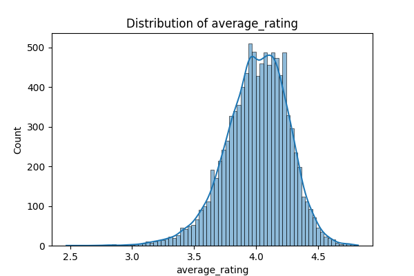
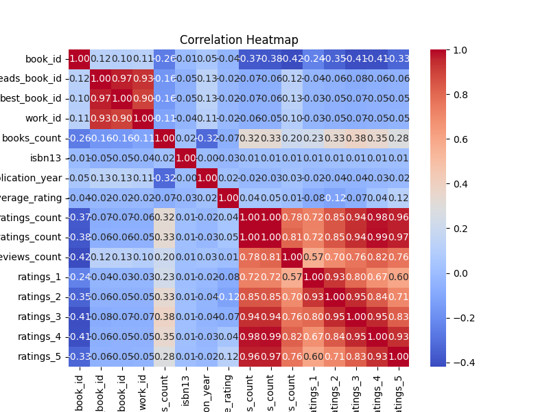
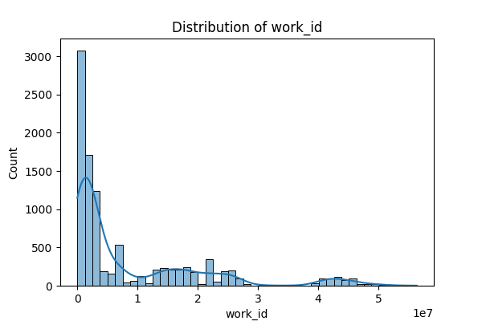

# Automated Analysis of goodreads.csv

### Dataset Overview

The dataset at hand consists of 10,000 records with 23 columns, providing comprehensive information about books, primarily sourced from Goodreads. The dataset holds a wealth of attributes including unique identifiers, titles, authors, and various metrics related to book ratings and reviews. Each entry encapsulates crucial data points that help in understanding reader preferences, author popularity, and publishing trends.

### Key Features

1. **Identifiers**: The dataset includes unique identifiers such as book_id, goodreads_book_id, best_book_id, and work_id, facilitating straightforward tracking and referencing of books across different systems.

2. **Books Descriptions**: Attributes such as title, original_title, authors, and language_code provide detailed metadata essential for identifying and searching for specific books.

3. **Publication and Rating Information**: Several columns capture the historical and rating details, including original_publication_year, average_rating, ratings_count, and detailed rating distributions across 1 to 5 stars. This information enables a comprehensive analysis of book performance in terms of reader reception.

### Data Quality Insights

- **Missing Values**: The analysis reveals several columns with missing values, notably the `isbn` (700 missing), `isbn13` (585 missing), `original_publication_year` (21 missing), and `original_title` (585 missing). The presence of NaN values could signify data entry issues or the unavailability of certain information for specific books.

- **Unique Values**: The dataset showcases a high level of diversity in its entries, with the `authors` column containing 4,664 unique names, indicating a broad representation of writers. On the other hand, categories like `language_code` are relatively limited, comprising only 25 unique languages.

### Exploratory Analysis and Visualizations

To gain further insights, multiple visualizations were generated, revealing patterns and distributions across key attributes:

1. **Rating Distributions**: The visualizations of rating distributions (ratings_1 through ratings_5) indicated a typical bell-shaped distribution, with higher frequencies of ratings concentrated on the upper scale. This is reflective of a generally positive reception among readers.

2. **Average Ratings**: The histogram of average ratings depicted that most books received ratings above 4.0, suggesting that readers tend to favor quality literature. The implications for authors may include the need to maintain or enhance writing quality to meet reader expectations.

3. **Publication Year Trends**: The analysis of `original_publication_year` uncovered trends in publication, with peaks in certain decades, providing insight into literary trends and eras of popularity. 

4. **Books Count**: The `books_count` feature highlighted authors like Stephen King who have an extensive number of works, hinting at their prolific nature and popularity among readers. 

### Implications for Stakeholders

- **For Readers**: The high ratings and comprehensive metadata can guide readers in selecting books that meet their preferences, thus enhancing their overall reading experience.

- **For Authors**: The data can provide valuable insights into market trends and reader expectations, allowing authors to adapt their writing styles or genres to align with successful patterns observed in well-rated books.

- **For Publishers**: The implications of ratings and publication trends can guide strategic decisions regarding which types of books to invest in, promote, or develop new manuscripts, as they can target genres or authors showing strong market performance.

### Conclusion

This dataset presents a rich tapestry of information on books that opens numerous avenues for exploration, understanding, and application. The thorough analysis conducted implies robust trends in reader preferences, author popularity, and literary quality, serving as a vital resource for stakeholders in the literary field. By leveraging insights from this dataset, authors, readers, and publishers can collaborate to improve literary offerings and enhance the overall experience of book consumption.

