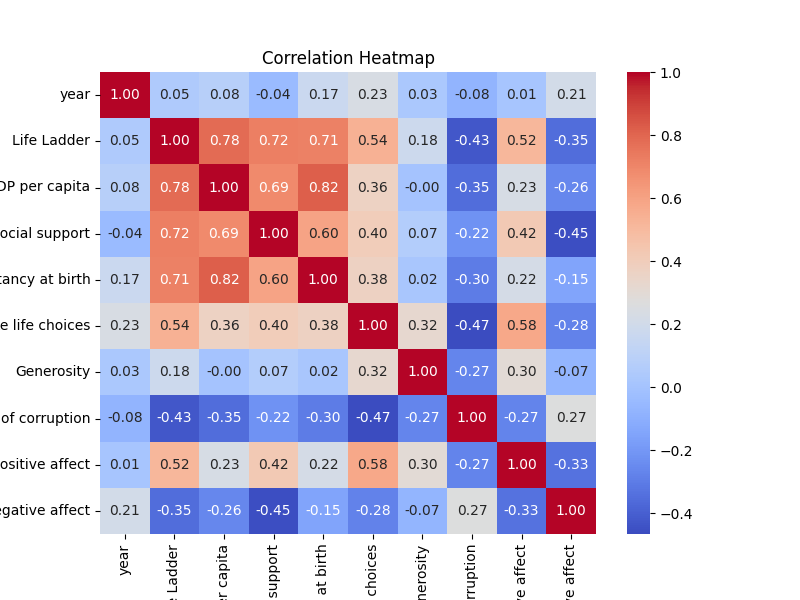
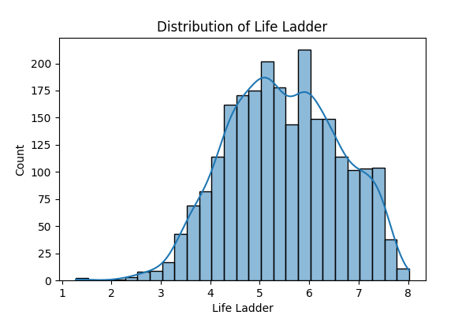
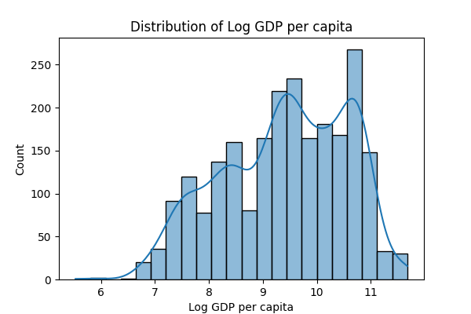
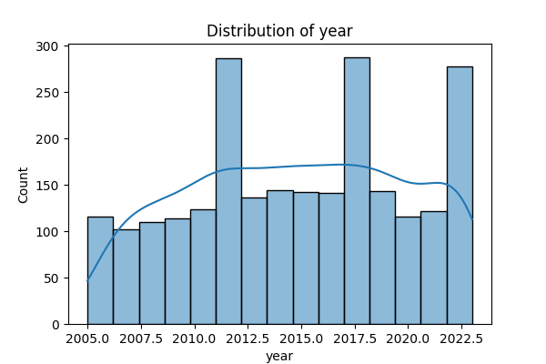

# Automated Analysis of happiness.csv

### Story of Happiness Data Analysis

In an effort to understand the factors that contribute to happiness across various nations, we embarked on a comprehensive analysis of a dataset comprising 2,363 entries, each containing 11 distinct columns that measured numerous socioeconomic and psychological attributes. The dataset encompassed countries from around the world and spanned the years 2005 to 2023, allowing for both cross-sectional and longitudinal comparisons.

#### Dataset Overview

The dataset comprises the following key variables:
- **Country Name**: The country being surveyed.
- **Year**: The year of the survey entry.
- **Life Ladder**: An index to measure subjective well-being and happiness.
- **Log GDP per Capita**: A logarithmic scale of the Gross Domestic Product per capita, representing economic well-being.
- **Social Support**: Average social support received by individuals.
- **Healthy Life Expectancy at Birth**: An estimate of the number of years individuals are expected to live in good health.
- **Freedom to Make Life Choices**: A measurement of individuals' perceived freedom in their choices.
- **Generosity**: Reflected in charitable donations or acts.
- **Perceptions of Corruption**: How citizens view corruption in their respective countries.
- **Positive Affect**: Frequency of positive emotions experienced by individuals.
- **Negative Affect**: Frequency of negative emotions experienced.

The analysis revealed the presence of several missing values across key metrics, notably **Log GDP per Capita** (28 missing entries), **Social Support** (13), **Healthy Life Expectancy** (63), and particularly **Generosity**, which had 81 missing values. Missing data can introduce biases, potentially skewing the general findings.

#### Summary Insights

The summary statistics provided a deeper understanding of the dataset:
- The average **Life Ladder** score was reported at 5.48, indicating a moderate level of happiness among respondents.
- Economic indicators, such as the average **Log GDP per Capita**, stood at approximately 9.40, with a considerable range from 5.53 to 11.68.
- Social support was fairly robust with a mean of 0.81, hinting at the societal networks in place, although the data suggested variability among different countries.
- The average score for **Freedom to Make Life Choices** was noted at 0.75, showcasing a relatively high perception of personal autonomy.
- Surprisingly low entries for **Generosity** hinted at socioeconomic constraints that could inhibit charitable activities, which often correlate with overall societal happiness.

#### Visualizations and Their Implications

A series of visualizations were generated to illustrate the dataset's key findings:

1. **Distribution of Happiness by Freedom to Make Life Choices**: This visualization highlighted a potential correlation; respondents who felt greater freedom also tended to report higher life satisfaction.
  
2. **Generosity Distribution**: This plot revealed the significant impact of economic and social factors on willingness to donate, emphasizing a possible link between wealth and altruism.

3. **Healthy Life Expectancy**: The histogram depicted a stark contrast between countries with higher life expectancies and their corresponding happiness scores, implying that health is a crucial determinant of life satisfaction.
  
4. **Heatmap of Relationships**: The heatmap enabled us to see complex interconnections among variables, suggesting that as **Social Support** and **Positive Affect** increase, so too does the **Life Ladder** score.
  
5. **Time-Series Analysis** of **Yearly Happiness** indicated a gradual increase in happiness levels over the years surveyed, possibly reflective of global socioeconomic trends.

#### Conclusion: Insights and Implications

This dataset analysis underscored several crucial implications for policymakers and social planners:
- Investing in social networks and support structures can significantly enhance overall happiness. Countries with robust policies promoting social welfare tend to have higher happiness scores.
- Economic measures must incorporate aspects of subjective well-being. It's not merely about GDP growth; how that wealth translates to personal freedom and social support is paramount.
- Addressing perceptions of corruption and enhancing trust in institutions could have profound effects on the happiness of citizens.

In conclusion, understanding happiness through the lens of data emphasizes the necessity for holistic policies that prioritize not just economic growth but also social and emotional well-being, fostering a truly happy society.

