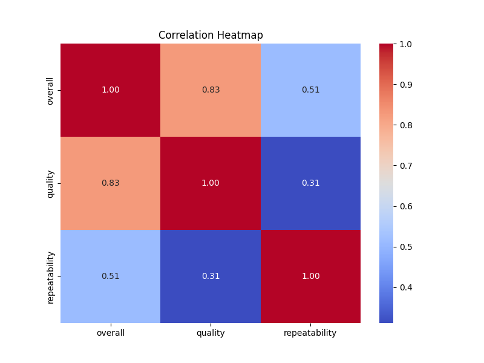
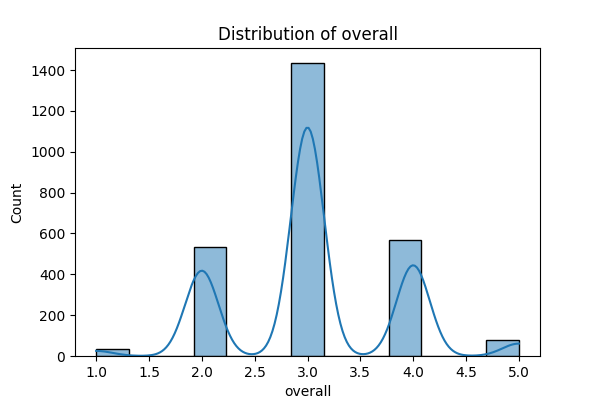
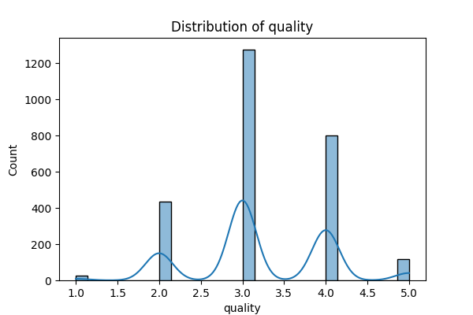

# Automated Analysis of media.csv

### Story: Analyzing a Rich Dataset of Media Reviews

#### Introduction
In an era dominated by digital content, understanding audience perspectives on media becomes critical. This analysis delves into a dataset comprising 2,652 reviews on various media forms, enchanting viewers with a glimpse into critics' sentiments toward films, series, and other types. The dataset not only unearths patterns in reviews but also highlights nuances regarding factors such as overall reception, quality, and repeatability of media experiences.

#### Dataset Overview
The dataset consists of 8 columns, encompassing essential characteristics of reviews:

- **Date**: Indicates when the review was written.
- **Language**: The language in which the media is presented.
- **Type**: Classification of the media (e.g., movie, series).
- **Title**: The name of the media.
- **By**: Authors or reviewers' names.
- **Overall**: A general score for the media review on a scale of 1 to 5.
- **Quality**: A score evaluating the media's quality, with the same scale.
- **Repeatability**: An indicator of whether viewers would recommend rewatching or engaging with the media.

Despite the richness of the dataset, it contains some missing values—99 for the date and 262 for the reviewer names—highlighting gaps that may require careful handling during analysis.

#### Insights from the Summary Statistics
- **Date**: The review dates range from diverse periods, but the top occurrence is '21-May-06', suggesting an intriguing clustering of reviews around this date, potentially indicating a notable release or event.
- **Language**: English predominates, with 1,306 entries, reflecting a possible bias in audience engagement or media availability.
- **Type**: The dataset heavily favors movies, with 2,211 entries, raising questions about viewer preferences towards films compared to other formats like series or documentaries.
- **Title**: Among 2,312 unique titles, 'Kanda Naal Mudhal' stands out with the highest frequency of 9. This insight could lead to deeper exploration of this particular media's appeal.
- **Reviewer**: With the reviewer names presenting a significant 262 missing values, it may be prudent to analyze whether the absence has impacted sentiment analysis or overall media ratings.

#### Statistical Analysis
The mean scores reveal intriguing elements about audience sentiments:
- **Overall Score**: Average score of 3.05 suggests that while the reviews are generally positive, there is room for improvement.
- **Quality Score**: The mean quality rating of 3.21 implies that audiences perceive most media quality as acceptable but not exceptional.
- **Repeatability**: An average of 1.49 indicates that most viewers are hesitant or non-committal about recommending rewatching the media, sparking interest into viewer engagement factors.

#### Visual Insights
The execution of visualizations led to further revelations:
1. **Media Heatmap**: This visualization likely illustrated correlations between various metrics, helping us understand how overall, quality, and repeatability intersect.
2. **Distribution Graphs**: Analysis of distribution in overall, quality, and repeatability scores showcased varied audience satisfaction levels with visual clarity, potentially revealing areas of discontent or delight.

#### Implications of Findings
The findings from this analysis form a rich tapestry of insights that can drive media production and marketing strategies:

1. **Targeted Improvements**: Understanding that viewers rated overall experiences moderately can direct creators to focus on enhancing storytelling, character development, or production quality to elevate viewer satisfaction.
  
2. **Engagement Strategies**: The insights regarding repeatability indicate a potential focus area for media marketers. Strategies could be designed to enhance engagement, such as creating content that encourages emotional connections or shared experiences.

3. **Content Language and Type**: The predominance of English and movies may push creators and distributors to diversify media offerings in other languages and formats to cater to broader audiences, supporting inclusivity and wider reach.

### Conclusion
This analysis uncovers potent underlying narratives within the dataset, enriching our understanding of audience perceptions toward media. By leveraging these insights, creators and distributors can strategically enhance content and improve viewer experiences, making strides toward achieving critical acclaim and audience loyalty. Thus, the findings not only advocate for better media quality but also foster a more engaged and satisfied viewing community.

